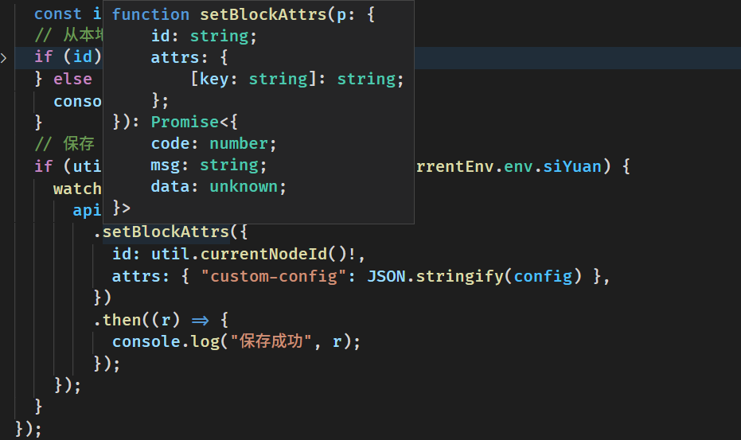

# siyuan_api_cache_lib

为思源挂件块提供 api 访问的工具库，同时具有缓存 api 调用结果到块属性上以及在非思源笔记环境下使用缓存结果的功能



## 目前提供的接口

- api
  - sqlQuery : 对 post /api/query/sql 接口的包装
  - setBlockAttrs : 对 /api/attr/setBlockAttrs 接口的包装
  - getBlockAttrs : 对 /api/attr/getBlockAttrs 接口的包装

查询类的 api 默认会进行缓存，非查询类的 api 则不会，可以通过查看函数的 noCache 属性来分辨，这个属性也是可以 set 的
(查询类的 api 也需要使用者自行斟酌避免过多的数据被缓存到挂件块的自定义属性）

- util
  - htmlDecode : 思源对于 setBlockAttrs 的属性会 encode ，所以提供此工具方法
  - currentNodeId : 获取当前挂件块的 id
  - getCurrentEnv : 获取当前所处环境，例如 思源 与 OceanPress
- config
  - server : 会在 api 请求路径的前面加上这个字段的值,便于开发调试
  - apiCache : 对 api 上方法的调用是否开启缓存，如果需要支持 OceanPress 请开启此选项

## 思源挂件块开发实践

由于本库使用了 `self.frameElement` 而 `frameElement` 只能在同源的情况下才能访问到,
所以我在开发的时候使用 nginx 进行转发来绕过这个问题
(和跨域无关，我使用 chrome 关闭跨域的安全策略还是无法在非同源的情况下拿到 `frameElement`)

配置 iframe 的资源链接为 `http://127.0.0.1/widgets/run-code/` (run-code 是我在开发的插件 [github.com/run-code](https://github.com/2234839/run-code)，建议查看这个项目里面对本库的使用方式)

对于在思源中的开发调试建议采用 nginx 进行如下配置，然后使用思源的在浏览器中打开，在这里进行开发调试

```js nginx conf
server {
    listen 80;
    server_name localhost 127.0.0.1;

    location / {
        #// 思源服务
        proxy_pass http://127.0.0.1:6806;
        proxy_set_header Host $host;
        index index.html index.htm;
    }
    location /widgets/run-code/ {
        #// run-code 所启动的服务， run-code 还配置了 base 路径为 /widgets/run-code/
        proxy_pass http://127.0.0.1:3000;
        proxy_set_header Host $host;
        index index.html index.htm;
    }
}
```

对于 OceanPress 的调试可以采用如下配置

```js nginx conf
server {
    listen 80;
    server_name localhost 127.0.0.1;

    location / {
        #// oceanPress 生成的静态站点目录
        alias 'D:/TEMP/思源test/';
    }
    location /widgets/run-code/ {
        proxy_pass http://127.0.0.1:3000;
        proxy_set_header Host $host;
        index index.html index.htm;
    }
}
```
